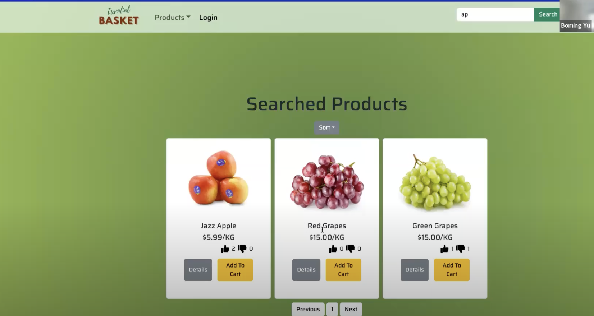
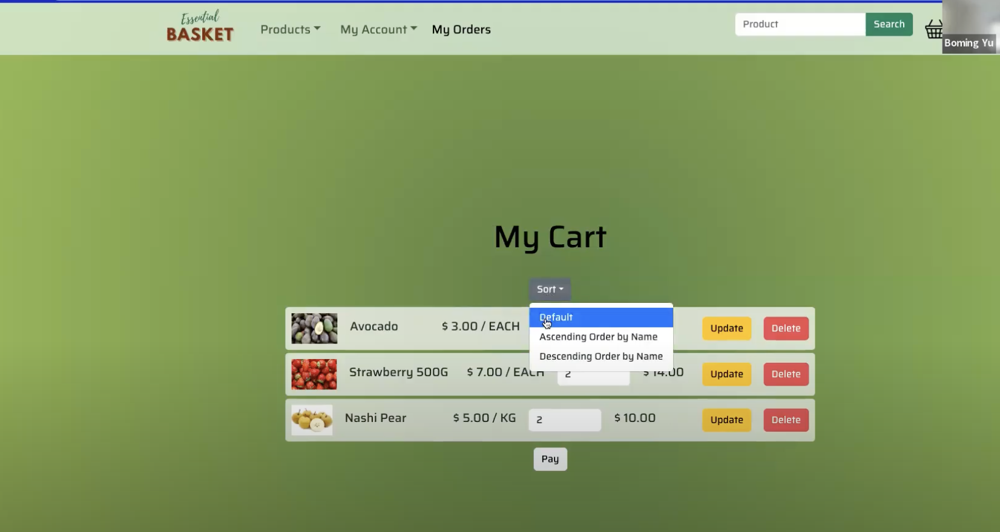

# Capstone_Project

## 1. Introduction

Welcome to our website's README file! Here is some basic information about our website:

### Website Name

#### Essential Basket

### Primary Target Audience / Website Purpose

Our website offers an online platform for the sale of fresh produce and essential household items, allowing users to easily browse, select, and purchase a variety of products.

### Layouts
**Main Pages**

    
    
    
    

**Login and Signup**

    
    
    

**User Pages**

    
    
    
    
    
    
    

**Admin Level**

    
    

**Comment and Rating**

    
    
    

**Database Structure**

    

## Customer Interface and Functionality

### 2. Customer Interface

#### 2.1. Browsing Products

Customers can browse a wide range of essential products on our website.

Products are categorized for easy navigation.

Sorting options include ascending and descending order based on price or product name.

In case of not being logged in, customers are restricted to browsing products only.

### 3. User Registration and Login

#### 3.1 Registration

Users can register by providing their username, full name, password, and email.

Email addresses are unique, and passwords are encrypted before storing them in the database.

After successful registration, users can log in.

#### 3.2 Login

Users can log in using their registered username and password.

Passwords are encrypted and compared for authentication.

Upon successful login, the website provides users with a token for future operations.

#### 3.3 Password Change

Users have the option to change their login password.

They need to input their old password, and if it matches, they can set a new password.

### 4. Product Selection and Shopping Cart

Users can add products to their shopping cart with a single click, with the default quantity set to 1.

They can modify the quantity of items in the cart or remove products as needed.

The website calculates the total price based on the selected items.

### 5. Placing Orders

Users can place orders for the items in their shopping cart.

During the ordering process, users provide recipient details, contact number, delivery method, delivery address (mandatory if not choosing self-pickup), and payment method (with payment information required if choosing card payment).

Upon successful order placement, the order status defaults to "Pending."

### 6. Order Management

Users can view their order history, including order status, details, and product information.

The website provides order filtering options based on order status, delivery method, and payment method for easier order tracking.

### 7. Order Modification

While an order is in the "Pending" state, users can make changes to certain order details, such as recipient name, contact number, delivery method, and delivery address.

Once an order reaches "Processing," "Shipping," "Completed," or "Cancelled" status, modifications are no longer allowed.

### 8. Product Reviews and Ratings

Customers can leave reviews and ratings (Like or Unlike) for products.

If a product has already been rated by a customer, clicking the same rating button will not add a new rating entry.

If a different rating button is clicked, the system will update the customer's rating for that product rather than creating a new entry.

## Admin Interface and Functionality

Additionally, our website includes an admin functionality that allows logged-in administrators to manage the website's operations, much like managing a physical store. Administrators have access to all the functionalities available to customers. Additionally, administrators have the following specific functionalities:

### 9. Admin Functions

#### 9.1 Add New Products

Administrators can add new products to the database.

To add a new product, administrators are required to provide the following details:

Product name

Barcode

Category

Price

Unit of sale

Stock

Product description

Product image (image path)

Availability status (can set products to "Available" or "Unavailable").

#### 9.2 Manage Products

Administrators can update the information of existing products.

Notably, when administrators remove a product, it is marked as "Unavailable" rather than being permanently deleted from the database.

#### 9.3 Manage Product Reviews and Ratings

Administrators have the authority to manage customer reviews and ratings for products.

They can delete customer comments on products or reset product ratings as needed.

#### 9.4 Order Management

Administrators are responsible for managing customer orders.

Based on the store's operational efficiency and inventory status, administrators can organize work and process orders.

Administrators can also modify the order status based on the actual situation, including changing orders to "Processing," "Shipping," "Completed," or "Cancelled."

This comprehensive admin functionality empowers administrators to oversee and manage various aspects of the website, ensuring smooth operations and customer satisfaction.

## Conclusion

In conclusion, our website offers a comprehensive online platform for purchasing essential products, from fresh produce to household necessities. Customers can enjoy a seamless experience, including product browsing, selection, shopping cart management, and order placement. User accounts provide convenience, and the admin functionality allows for efficient management of products, reviews, and orders.

We are committed to providing a user-friendly and secure environment for all users, whether customers or administrators, to ensure a satisfying and efficient online shopping experience.

If you have any questions, need assistance, or wish to provide feedback, please do not hesitate to contact us. Thank you for choosing our website for your essential product needs.

